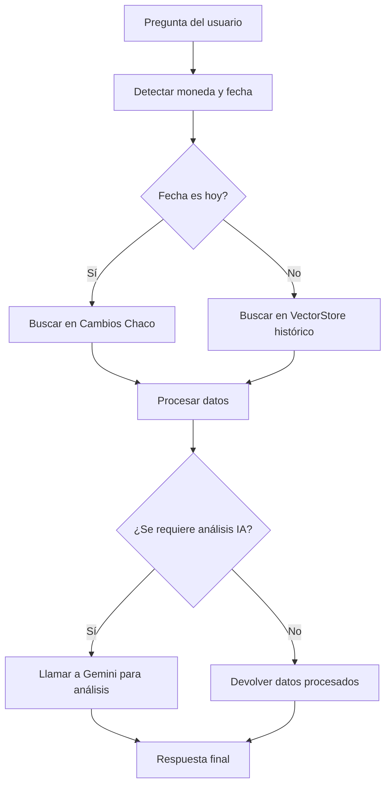

# 💱 Agente de Cotizaciones de Monedas con LangGraph, RAG y Gemini

Este proyecto es una API construida con **FastAPI** que permite consultar cotizaciones de distintas monedas, usando datos **en vivo** y **datos históricos** combinados con análisis de IA.  
Está pensado para el mercado de Paraguay (PYG), usando como fuentes principales:

- **Cambios Chaco** → Cotizaciones actuales
- **Banco Central del Paraguay (BCP)** → Datos históricos
- **Gemini API (Google)** → Análisis y contexto financiero (opcional, según la consulta)

---

## 🚀 Características

- Consulta de **cotizaciones actuales** por moneda.
- Búsqueda de **cotizaciones históricas** por fecha o rango de fechas.
- **Análisis inteligente** de variaciones de precios usando IA (Gemini).
- Integración **RAG** (Retrieval-Augmented Generation) para usar datos existentes y reducir consumo de IA.
- Soporte para múltiples monedas (USD, BRL, EUR, JPY, etc.).
- API REST lista para usar con **FastAPI**.

---

## 📂 Estructura del proyecto

```
.
├── src/
│   ├── agent.py                # Lógica del flujo con LangGraph
│   ├── api.py                  # Endpoints de FastAPI
│   ├── mcp.py                  # Registro de herramientas MCP
│   ├── rag/
│   │   └── vectorstore.py       # Almacenamiento y búsqueda de datos históricos
│   ├── tools/
│   │   └── cotizaciones_tool.py # Scraper y funciones de obtención de datos
│   └── ...
├── data/
│   └── vectorstore.pkl          # Datos históricos almacenados
├── README.md
└── requirements.txt

```

---

## ⚙️ Instalación

1. **Clonar el repositorio**
```bash
git clone https://github.com/crisporcal/cotizaciones-agent.git
cd cotizaciones-agent
```

2. **Crear y activar entorno virtual**
```bash
python -m venv .venv
source .venv/bin/activate   # Linux/Mac
.venv\Scripts\activate      # Windows
```

3. **Instalar dependencias**
```bash
pip install -r requirements.txt
```

4. **Configurar variables de entorno**
Crea un archivo `.env` en la raíz con tu clave de Google Gemini:
```
GOOGLE_API_KEY=tu_api_key_aqui
```

---

## ▶️ Uso

1. **Levantar el servidor**
```bash
uvicorn src.api:app --reload
```

2. **Consultar la API**
Ejemplos con **Insomnia**, **Postman** o `curl`:

### Cotización actual
```json
POST /ask
{
  "question": "cual es la cotizacion del dólar hoy"
}
```

### Cotización histórica (fecha exacta o "ayer")
```json
POST /ask
{
  "question": "cual fue la cotizacion del real ayer"
}
```

### Análisis IA con contexto histórico
```json
POST /ask
{
  "question": "como estuvo el euro estos días"
}
```

---

## 🧠 Cómo funciona

### Flujo general


1. **Detección de moneda y fecha** desde la pregunta del usuario.
2. **Obtención de datos**:
   - Si es **hoy** → busca en Cambios Chaco (cotización actual).
   - Si es una **fecha pasada** → busca en el VectorStore (histórico).
3. **Análisis con IA**:
   - Solo si es necesario (comparaciones, tendencias, contexto).
   - Usa **Gemini 1.5 Flash** para generar un reporte breve en español.
4. **Respuesta final** → Devuelve cotización, fuente y análisis.

---

## 📌 Monedas soportadas
Incluye pero no se limita a:
- USD, BRL, EUR, JPY, GBP, CHF, SEK, DKK, NOK, ARS, CAD, ZAR, XDR, XAU, CLP, UYU, AUD, CNY, SGD, BOB, PEN, NZD, MXN, COP, TWD, AED.

---

## ⚠️ Notas
- El uso de Gemini está sujeto a **límite de 50 requests diarios** en el plan gratuito.
- Si el sistema detecta que puede responder con datos históricos sin IA, evitará llamar a Gemini para ahorrar cuota.
- El scraper de Cambios Chaco puede dejar de funcionar si la página cambia su estructura.

---

## 📜 Licencia
MIT License.
